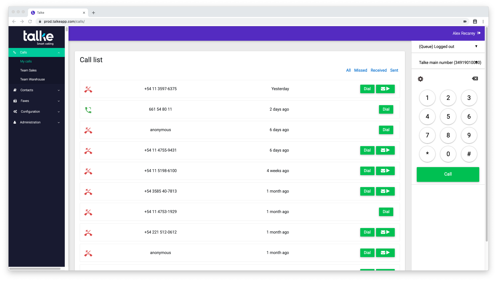
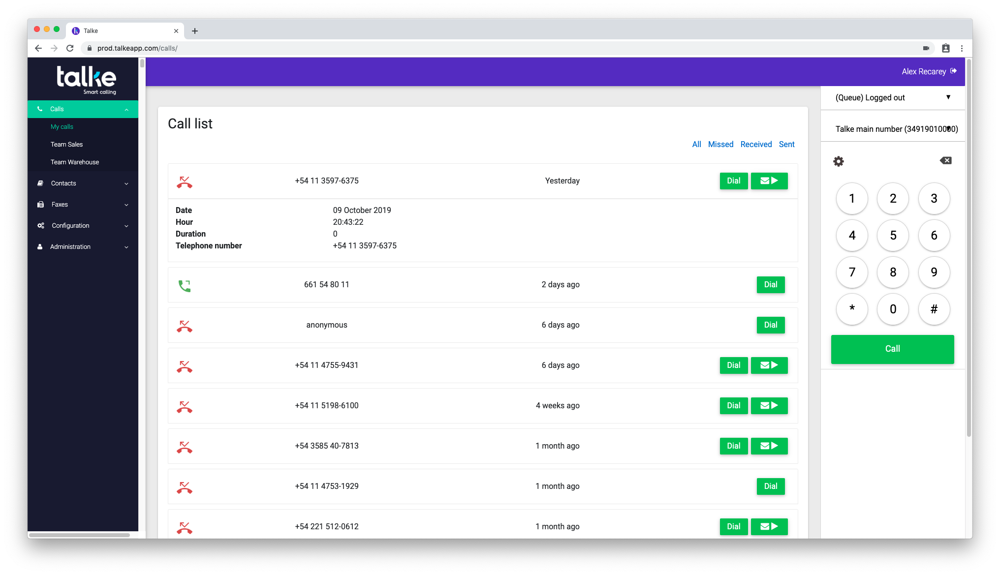
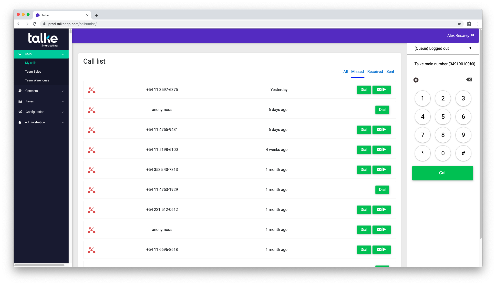
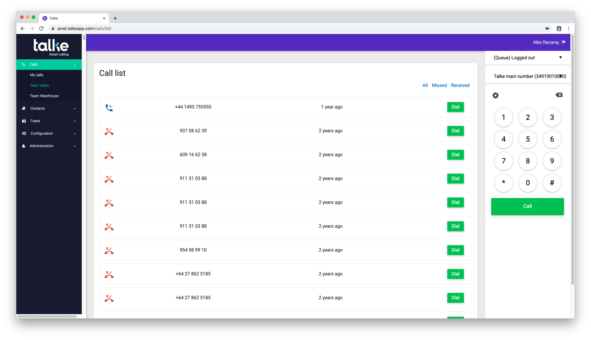

============
Call history
============

In the *Calls* menu you have access to view your call history in different ways.

My calls
---------

The *My calls* page shows calls made directly to you, or made by you. Calls made
to a team that you are in, that are answered by you, will show up in a different
page underneath the *My calls* page.

You can click on a call and detailed information for that call will show.

The list of calls can also be filtered by their type, *Missed*, *Received*, or
*Sent*.

For example, a list of missed calls would show the following screen.

Team calls
----------

Calls that are directed to a team that you are from will show up in a
different list. These calls are not targeted twoards you specifically,
they are generally calls made to the *Sales team* or similar. If you
are part of the team, you have access to see those calls. You have the
same funcionality to view these calls as you would seeing your own
calls. Note that team calls do not have a *Sent* calls option, as you
cannot call from a group.

Voicemail
---------

Some missed team or personal calls may have a voicemail attached to
them. In this case, you will se a small folder icon with a play sign
in the call row. To listen to the voicemail, click the folder
icon. You should be able to hear the voicemail left.

