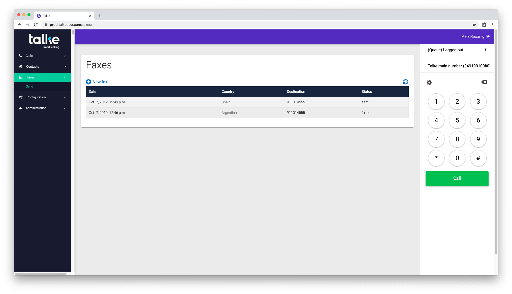
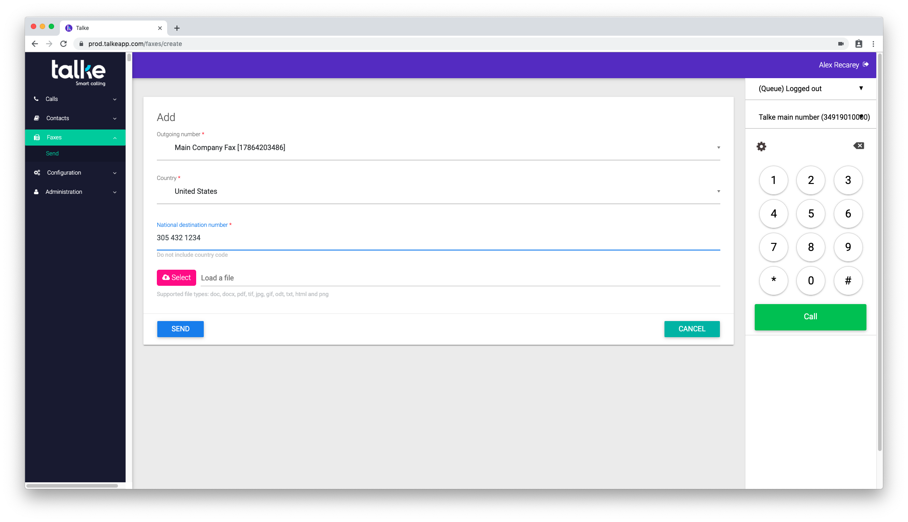

============
Faxes
============

In the *Faxes* menu you can view your sent faxes and send new faxes.

Send
---------

The *Send* menu will show you the list of faxes sent. The list will
show the date, destination and status of the sent fax. The list can be
refreshed by pressing the circular button on the top right.

To send a new fax, press the *New fax* button.

New fax
--------

To send a new fax, all of the following fields must be filled out.

Outgoing number
~~~~~~~~~~~~~~~~

This is the fax line selected to send the outbound fax. This number
will show up to the receiver of the fax as the number that dialled the
fax.

Country
~~~~~~~

The country to where the fax will be sent.

National destination number
~~~~~~~~~~~~~~~~~~~~~~~~~~~

The number to dial, without the coutry code. For example, to send a
fax to the US, first select USA from the country dropdown, and then
write the number without the 1. eg. 3051231234

Load a file
~~~~~~~~~~~

The pink *Select* button will allow you to select a file from your
computer to send by fax. The following file types are supported:

 * doc
 * docx
 * pdf
 * tif
 * jpg
 * gif
 * odt
 * txt
 * html
 * png

Bear in mind that the file will be formatted to fit a paper by
"printing" the file on our servers. PDF files are already laid out for
printing and so will be most true to form with the final product.

Send and Cancel action buttons
~~~~~~~~~~~~~~~~~~~~~~~~~~~~~~~~~

The action buttons will *Send* the fax or *Cancel* the form. If the
form is cancelled there is no way to recover it, you must start again.
