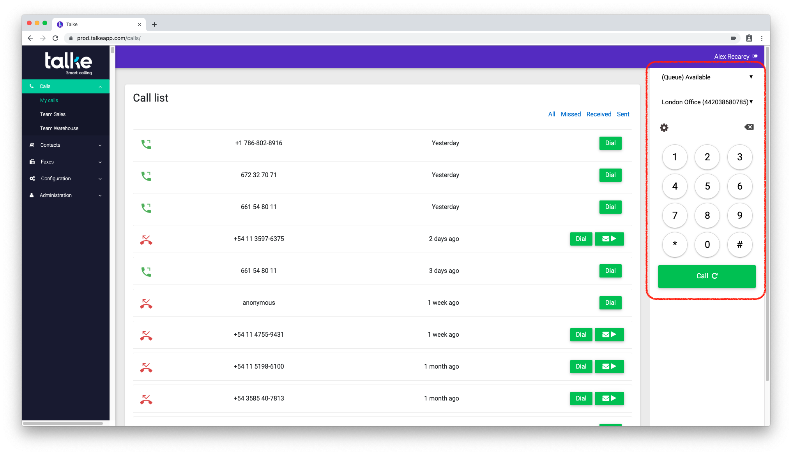
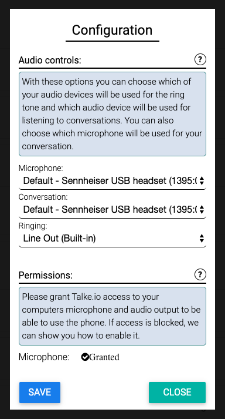
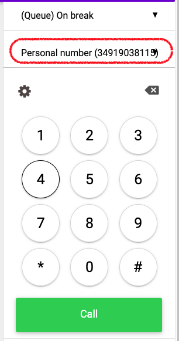
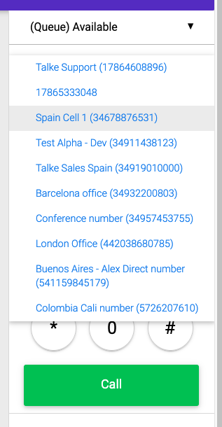
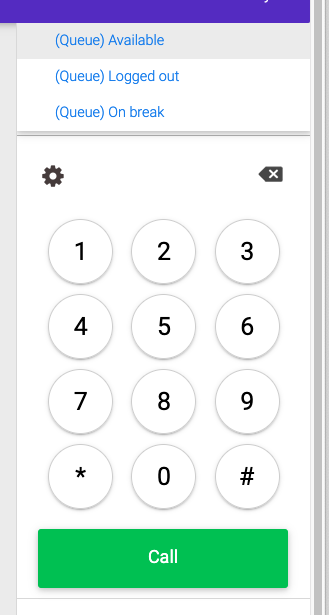
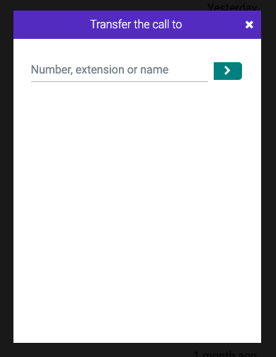
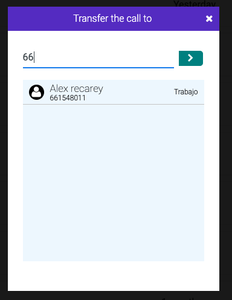
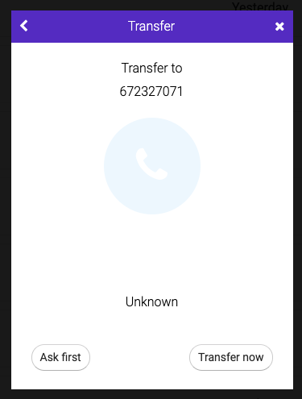
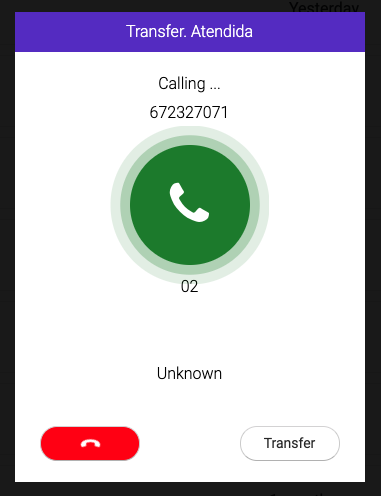

=============
  Web phone
=============

.. contents:: Table of contents

Location
--------
The webphone is found on the right side of the screen.

   Location of webphone

Configuring the audio system
-----------------------------

It is important to set up the audio system correctly. By pressing the wheel icon (|settings|)
on the web phone, you will bring up the audio settings page.

   The audio settings page

This page will allow you to select the microphone to use for speaking, and also the audio
output to use for the conversation, and the audio output to use for the phone ringing.

This will allow you to use your headphones to speak, but still have the ringing use the
laptops speakers.

Also, make sure you have granted Talke permission to use the microphone. You can check
at the bottom of the settings page.

Making calls
------------

To make calls with the webphone, you can input the number to dial using the
keypad or your computer's keyboard. After typing in the number, press enter or
click on the green "Call" button.

If the green "Call" button has a circular arrow on it, pressing it without typing
in a number on the screen will redial the latest number.

You can also return calls by clicking the green phone button on any of the calls
in your :doc:`Recent Calls<calls>` list.

Selecting the outbound number to show
~~~~~~~~~~~~~~~~~~~~~~~~~~~~~~~~~~~~~

You can change the number shown to people you call. To do that, click on the second
box from the top, that contains the friendly name of the number and the number.

When you click on that, a dropdown will deploy showing all of the numbers owned by
the company. You can select any number from the dropdown, and your calls will appear
to be made by the number in question.

Receiving calls
---------------

To receive calls, just press the green "Answer" button. The callers information, including
which number of the company they dialled, is shown on the screen.

You can also reject the call by pressing the red button.

Managing your queue status
--------------------------

If you are part of a Callcenter Queue, your Queue status will be shown at the top of
the screen. You can change your status by clicking and selecting one of the available
statuses.

The available statuses are:

 * Available
 * Logged out
 * On break

If you are available you will receive calls from the Queues you are a part of. If you log
out or are on break, you will not receive calls. Bear in mind, these status changes will
show up in the daily callcenter report.

Transfers
----------

Transferring calls with the webphone is done in a completelty visual way and will be
easier to achieve than using the traditional desktop phones.

To start a call transfer, while you are already in a call, press the transfer button
(marked with the text "Transf.") on the web phone.

.. figure::img/en.phone.callinprogress.png

   The call in progress screen

This will then show you the *transfer destination selection* screen.

   The transfer destination selection screen

In this screen you can type in the number you wish to transfer the person to. If
the person is in your contacts, you will see a list of people matching the number
you have dialled. If you know the party you are trying to reach is in your contacts,
you can directly type in their name.

   The *transfer destinations selection* screen will fill up with matches from your address
   book.

Once you have input the number you wish to transfer the call to, the *transfer type* screen
will show up. In this screen you must select whether to use an *Attended* or *Unattended*
transfer.

   The transfer type screen

In *Attended* transfers, you speak to the person you want to transfer the call to, and make
sure he is ready to receive the call. Once you have spoken, you can then decide whether
to transfer the call to him, or recover the call from the caller to inform him, for example,
that the caller is not available.

In *Unattended* transfers, you directly send the call off to the transfer destination. This
mode is commonly used to transfer the call to a queue as there is an expectation the caller
will be waiting for a while, and this will free you up to take another call.

If you have selected *Attended* transfer, you will then have access to the *Transferring*
screen, where you can speak to the transfer recipient and finally decide whether to
transfer the call or to get back to the caller.

   The Transferring screen. From here the red button hangs up the call to the transfer
   recipient, and the transfer button sends the caller over to the transfer recipient.
